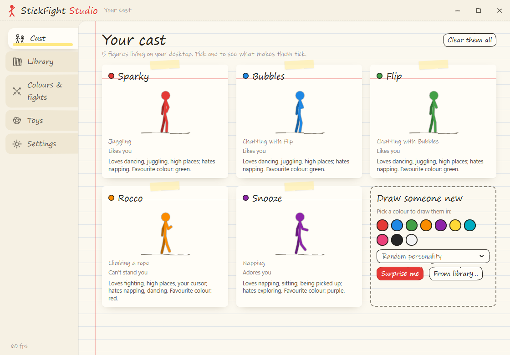
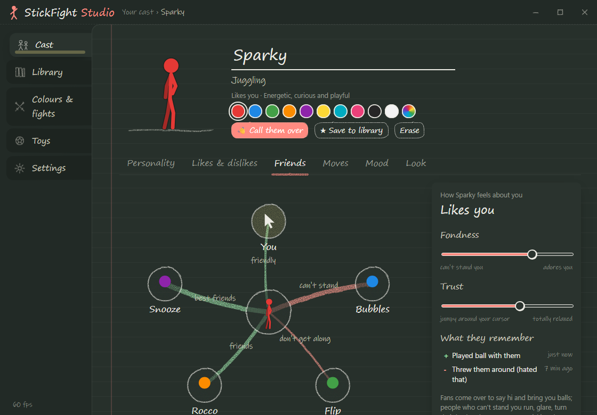

# StickFight

Stick figures that live on your Windows desktop. They walk along your taskbar, jump between windows,
climb window edges (or throw a grappling hook up them), nap, chat, dance and high-five each other, play
with balls, and fight, with knockouts, flying kicks and figures sent flying across your screen. Each one
has its own personality, its own way of moving, its own likes and dislikes, friendships, and feelings
about **you**, built from how you treat it.

> Early preview (v0.4). Windows 10/11, 64-bit.



## Why this exists

I grew up on stick-figure animations, especially *Animator vs. Animation*, where a little stick figure
breaks loose on someone's desktop and starts fighting back. I always wanted one of those guys living on
my own screen. So I set out to see whether Claude could help turn that childhood memory into real,
working software: I described what I remembered and what I wanted it to feel like, and Claude
designed and built it with me, from the physics and animation to the personalities and fights, while I
played with every build and kept pushing for more life in it. StickFight is the result: a little world of
stick figures that treats your real desktop as their playground, climbing your windows, playing with
your cursor, and settling their differences in fights.

*Inspired by Alan Becker's* Animator vs. Animation. *This is a fan-made project and isn't affiliated with
or endorsed by him.*

## Download and run

1. Grab `StickFight-v1.0.0-win-x64.zip` from the [latest release](https://github.com/Lindorak/StickFight/releases/latest).
2. Unzip it anywhere and run `StickFight.exe`. It runs from wherever you put it; if you'd like it in the Start menu
   (and in Installed apps, to remove it the usual way), click **Install StickFight** in Studio → Settings. No admin
   rights needed, and your figures come along.
3. Windows may show "Windows protected your PC" because the app isn't code-signed (that needs a paid code-signing
   certificate): click **More info → Run anyway**.

StickFight checks GitHub once a day for a newer version and offers it in the Studio; updating is one click (you can
switch the check off).

A figure appears and sketches itself onto your screen. Everything else lives in the **tray icon**
(bottom-right, near the clock): **left-click** it for the **StickFight Studio**, **right-click** for a quick
panel (draw a figure, toss in a toy, hide them, quit).

## What you can do

- **Draw figures** in any colour, with a personality preset or a random one, or bring back **your saved
  figures** from the library. Each one gets its own name, personality, tastes, look and way of moving.
- **Drag** a figure by a limb and let go while moving to **throw** it. **Click** to poke, move the cursor
  gently over one to **pet** it. Some fight back when picked up, some flail, some love it.
- **Right-click anything** for a quick menu right where you clicked: recolour, resize, kick a ball, tip
  over or flip a chair, turn the radio off, call a figure over, make it dance... Everything else is one
  click away in the **Studio**.
- **Type anything** ("a giant red couch", "pizza", "a hammock") and it's drawn into the world. Figures
  understand objects by what they can do with them: sit, nap, swing, bounce, eat, hide, read, warm up,
  dance, wield, shoot or play.
- **Sports**: goals, hoops, tennis and badminton nets. Figures organise games, pick teams, keep score and
  celebrate (or sulk).
- **The Creator's Pencil**: give it to a figure and it draws itself whatever it wants.
- **They ask for things**: a thought bubble when they want a snack, a ball or a bed. Click it and it
  drops in beside them.
- **Your screen is part of their world** (all of it can be switched off, and nothing ever leaves your PC):
  - lines of text and pictures in your windows become ledges to stand on;
  - they walk over to words they know and love them, hate them, or run from them (spiders!);
  - now and then one points out a link in a bubble (it only opens if you click it);
  - they dance when music plays and sit down to watch when a video's on.
- **Pets that feel real**: cats, dogs, parrots, rabbits and hamsters (or a kitten, puppy, chick, kit or pup that
  grows up over a few hours), each with a temperament (shy, bold, lazy, mischievous, affectionate, playful).
  - **Needs**: they get hungry, thirsty, tired, bored and lonely, and need the bathroom. Fill their bowls, scoop the
    litter box, take dogs out on a **leash** (it runs from the collar to your cursor), and clean up any accidents.
    They ask for what they need with a little thought bubble.
  - **Lives of their own**: cats stalk parrots and knock things off ledges; dogs chase cats; they squabble over
    food and beds, or become friends who play-chase and curl up together. Parrots fly, perch (on a figure's head,
    or on your cursor), and learn to say things they hear.
  - **Training**, with a spray bottle and treats. Timing matters: spray within a couple of seconds of the misdeed
    and they slowly learn; spray late, or for nothing, and they just get upset. Parrots love a misting.
  - **Health and hygiene**: neglect, stress and scraps wear them down; they can catch a cold, an upset tummy,
    fleas or a sprain. Take them to the vet, give them a bath (cats will not thank you) or a brush.
  - **A fish tank** to keep fed (drag its sides, top or a top corner to resize it like a window; bigger tanks hold
    more fish): figures find it calming, cats can't stop staring.
  - **Families, tricks and clothes**: bonded pairs can have a litter (the young take after their parents and
    follow their mother about). Teach tricks (roll over, high five, play dead, spin) with treats; dress them in a
    bandana, sweater or bow (dogs put on a raincoat by themselves for a rainy walk). Rabbits binky and nibble the
    garden; hamsters are up all night on their wheel.
  - **Pet-only mode** if you just want animals, and a care setting (relaxed, normal, realistic). The Studio's
    **Pets** tab shows needs, mood, weight, training and a care log.
- **Weather and time of day**: now and then rain, a thunderstorm or (in winter) snow. Figures shelter, grab
  umbrellas, dance in the rain, have snowball fights and build snowmen. Late at night they get sleepy.
  Or switch on **your real weather**: type your town and the sky follows the actual weather there (from
  Open-Meteo; only the place name, once, and then its coordinates are ever sent). Hot days send them to the
  pool; cold ones to the campfire.
- **Lights after dark**: lamps, fairy lights and lanterns come on at dusk and light up whoever's near them, and
  treehouse windows glow.
- **Town life**: figures have **jobs** (shopkeeper, chef, entertainer, teacher, builder) and earn **coins**,
  which they spend at the shop stall, on a meal at the food cart, or as tips for whoever's performing on the stage.
  Kids go to **school** at the chalkboard. **Builders** put up forts and treehouses that become homes (friends
  lend a hand). Turn on **ageing** and they count their years: elders go grey, slow down, lean on a cane and
  retire. Moods are catching, and so is laughter. Asleep, they **dream** (a little cloud) about their own lives,
  sometimes nightmares, and write the dreams down in the morning.
- **Out and about**: bikes, skateboards and go-karts to ride up and down; a pond with ducks and ducklings to swim
  in or **fish** at; a swimming pool.
- **Town events**: every so often (or whenever you like) a **festival** (lights, dancing, fireworks after dark),
  a **talent show** (acts take turns on stage, the best wins a trophy) or a **race day** (line up, countdown,
  sprint for the chequered flag).
- **Diaries**: every figure writes about its day in its own voice. Read them in the Studio.
- **Talk to them**: right-click a figure and type. They answer in their own voice (and a little babble):
  how they feel, what they like, what they think of the others, a joke if you ask. All understood locally.
- **Play with them**: **hide-and-seek** (close your eyes while they hide behind the furniture, then click
  the hiders; they giggle when you're close), **tag** (touch one with the cursor, then run) and **catch**
  (touch the ball to catch it and send it back). Or hold a **tournament**: a sparring bracket on the floor,
  the others cheering, and a crown for the champion.
- **Photo mode**: everyone squeezes in, says cheese, and you get an instant-photo-style picture in
  `Pictures\StickFight` (if your Pictures folder syncs to OneDrive, so do the photos).
- **Record a clip**: ten seconds of everyone as an animated GIF (just them and their things, drawn on paper; never
  what's on your screen), saved to `Pictures\StickFight`.
- **Talk out loud** (opt-in): press 🎤 and speak. Say a name and what to tell them ("Sparky, come here"), ask for
  something ("make a pizza"), or call for a race, a photo or some snow. Windows' own speech recognition, on your PC.
- **AI conversations** (opt-in, your own OpenAI key): figures answer what you say with a language model, in
  character. Off, they answer the usual way, all locally.
- **Reminders**: set one (once, daily, weekdays, weekly), or import a calendar file (.ics), and a figure brings it to
  your cursor when it's due. They also cheer when a download finishes (only the file's kind is noticed) and come to
  check on you if you seem frustrated (rage-clicking, slamming windows shut).
- **Several casts**: save your cast under a name, start a fresh one, switch back whenever you like.
- **Mods**: add your own objects (as SVG or shapes), hats, names and jokes with JSON files. See
  [docs/MODDING.md](docs/MODDING.md).
- **Life**: skills that grow with practice (juggling, climbing, fighting, ball games, dancing, drawing),
  favourite places (and spots they avoid), birthdays with a cake and a song, Halloween costumes, Christmas
  hats and New Year fireworks, and a welcome when you come back after a while away.
- **Bodies**: weight goes up with overeating and treats and down with exercise. Heavier figures fill out properly
  (a rounder torso, thicker limbs, fuller face), move slower and tire sooner. Everyone has stamina, and comfort
  matters: no bed means a grumpy night on the floor. Both weight and stamina can be switched off.
- **Social life**: rivalries and rematches, clubs of close friends (with matching bandanas), campfire stories and
  sleepovers, hobbies (gardening, collecting trinkets, storytelling), and they remember the gifts you gave them.
- **The world turns**: trinkets turn up for collectors, gardens grow from seed to bloom (water them!), leaves
  blow in during autumn (run through them!), blossom in spring, fireflies on summer nights, pumpkins at
  Halloween and a tree at Christmas.
- **Campfires** that look and feel real: layered flames, embers, sparks and smoke, and warm flickering light on
  everyone around them (stronger at night, when everyone else dims).
- **Lassos**: figures rope each other, balls, and (if you allow it) your cursor, then spin it round and fling it.
  Only when you've left the mouse alone; move it and it breaks free.
- **The Stick Times**: a weekly newspaper in the Studio with the week's big stories, and a **sticker book** to fill.
- **Homes and families**: a figure that naps somewhere twice makes it home (with a little flag); they go home
  at night and visit each other. Sweethearts who've been together a long while can have a **baby**, who
  toddles after its parents and grows up over a few hours.
- **They notice the desktop**: they ride windows you drag (and fly off if you shake them), react when a
  window closes under them, look over at notifications, and fans cheer when you finish a long stretch of typing
  (only the timing is noticed, never what you type).
- **Sound**: footsteps, punches, boings, a radio, rain and thunder, barks and purrs, all synthesised on the fly.
- **Colours & fights**: decide how colours get along (friends, rivals who spar, enemies who really fight),
  how hard they hit, health bars, and what happens at zero health (up to **permanent death**).
- **Graphics**: presets from low to ultra, or set each part yourself: soft shadows, shadows cast on the
  window behind, shading, faces, motion smears, and a simple or detailed look for objects.
- **Settings**: frame rate, paper or chalkboard look (the whole app follows it, bubbles included), sound and
  voices, screen features, romance, babies, wishes, celebrations, and remembering everyone between runs.
- **Accessibility and comfort**: a **calm mode** (no fights, tournaments, cursor hunting, lightning or freeze-frames),
  **colour-blind badges** (each colour team wears its own shape), **quiet hours** (hidden on the days and times you
  choose), and a **battery saver** (lighter frame rate and graphics when unplugged, or always). It starts in about a
  second and uses about 150 MB.

## How they behave

Each figure has six traits (energy, curiosity, bravery, playfulness, aggression, sociability), needs
that change over time (stamina, hunger, boredom, loneliness, annoyance, joy, sadness, fear), its own body
language, a look (hats, hair, beards, glasses, clothes, capes) and tastes. Every decision scores its
options from all of that: nap when tired, go exploring when bored, find a kindred spirit when lonely, hide
when scared. Decisive figures go for what they want most; playful ones are more spontaneous; things they've
done a lot lately lose their shine. The Studio's **What's on their mind** panel shows the options they
weighed and the route they're following.

**They find their way around.** The desktop is a map of every surface (window tops, text lines, furniture,
the taskbar) and the moves between them: walk, step off and drop, jump (every arc is checked to really land
where it should), climb a window's side or throw a grappling hook. Routes are planned with A*, weighted by
personality (climbers like climbing, the timid avoid big drops), and moves that fail are avoided for a while.

**They have relationships.** With each other: friendships built on shared tastes and time together, grudges
from fights, and bystanders who take sides when someone's mistreated. **Romance**: each figure is a girl, a
boy or nonbinary and has its own attraction (all editable). Crushes make them blush, show off and seek the
other out; eventually they confess. Couples hold hands, spend time together, defend each other and get
jealous; love that runs out ends in a breakup and some heartbreak. Grudges fade with time, and the
forgiving go and say sorry. **With you**: they remember what you did
(throwing them around, petting, playing ball, giving them what they asked for). Fans come to say hi; those
who can't stand you glare, run, or box your cursor. Cursor **hunters** never forgive you.

Fights aren't scripted. Each fighter reads distance and its opponent's wind-ups, chooses moves in its own
style, blocks, ducks and dodges, and only lands a hit if the fist, foot or weapon actually connects.


## Build from source

Requires the [.NET 9 SDK](https://dotnet.microsoft.com/download).

```
dotnet run -c Release
```

Command-line options: `--spawn N` (start with N random figures), `--scale X` (size multiplier),
`--platforms` (show the surfaces they can stand on), `--debug` (see below).

Self-contained release build:

```
dotnet publish -c Release -r win-x64 --self-contained -p:PublishSingleFile=true -p:IncludeNativeLibrariesForSelfExtract=true -o publish
```

### Layout

| File | What |
|---|---|
| `App.cs` | Frame loop, input, tray, dirty-region rendering, save/restore |
| `App.Studio.cs` | Bridge between the world and the Studio (state out, edits in) |
| `App.Items.cs`, `App.Screen.cs`, `App.Wish.cs` | Summoning objects, the screen reader's ledges and link bubbles, wish bubbles |
| `App.Games.cs`, `Tournament.cs` | Games with you (hide-and-seek, tag, catch), photo mode, tournaments |
| `App.Family.cs` | Babies arriving and growing up, home flags, the tournament board |
| `Pet*.cs`, `App.Pets*.cs` | Animals: body and flight, needs and care, mind, social life, training, drawing; pet mode, care clicks, spray bottle, leashes |
| `Figure.Body.cs` | Body weight: torso shape, tapered limbs, posture and gait |
| `Clubs.cs`, `News.cs`, `Seasons.cs`, `App.World.cs`, `App.Paper.cs`, `App.Lasso.cs` | Clubs, the news log and stickers, seasons, trinkets and gardens, the weekly paper, lassos |
| `Gfx.cs` | Graphics presets and shadow helpers |
| `Studio/` | The Studio window (WebView2) and its hand-drawn web UI (`Studio/web`) |
| `Overlay.cs` | Transparent, click-through, topmost window |
| `Renderer.cs` | Direct2D/DirectWrite on a DirectComposition swap chain |
| `Env.cs` | Reads windows/monitors; builds platforms (window tops, taskbar, text lines, furniture) and climbable walls |
| `NavGraph.cs` | The map of surfaces and moves, checked jump arcs, A* route planning |
| `ScreenSense.cs` | Background UI Automation reader (text, words, links, pictures) and audio-session listener |
| `Items.cs`, `Item.cs` | The object catalogue (shapes + verbs) and object physics/drawing |
| `Sports.cs`, `Projectile.cs` | Matches and scoring; darts and water from toy guns |
| `Look.cs`, `UiTheme.cs`, `Sound.cs` | Outfits, the paper/chalkboard look for in-world UI, synthesised sound |
| `Romance.cs` | Gender and attraction |
| `Pet.cs` | Cats and dogs: body, movement, moods, bonding, drawing |
| `World.Weather.cs` | Rain, storms, snow cover, day and night |
| `App.Events.cs` | Typing (timing only) and notification watching; debug test window |
| `Figure*.cs` | The body: movement, procedural animation, climbing, grappling hook, moves, combat, drawing |
| `BodyStyle.cs` | Per-figure body language (walk, run, idle, climb, jump, fight, celebrate, rope styles) |
| `Tastes.cs` | Likes and dislikes |
| `Ragdoll.cs` | Verlet ragdoll physics |
| `Brain*.cs` | Needs, decisions (`Brain.Mind`), route following, social life, romance, wishes, screen reactions, tastes, feelings about you, ball play, sports, fighting, skills and celebrations (`Brain.Life`), games, talking, homes and families |
| `Fight.cs` | Colour relationships, gear, and the move list |
| `Prop.cs` | Ball physics and drawing |
| `Settings.cs` | Persisted preferences, cast and library (`%APPDATA%\StickFight\settings.json`) |

### Debug tools

With `--debug`, the app writes `%TEMP%\stickfight_state.json`, logs events to
`%TEMP%\stickfight_events.log`, and runs commands written to `%TEMP%\stickfight_cmd.txt` (one per
line), e.g. `spawn blue hothead`, `ball SoccerBall`, `rel Red Blue Enemies`, `Red fight Blue`,
`Red spar Blue`, `Red juggle`, `Red chat Blue`, `Red flip`, `Red climb`, `place Red 1500 2000`,
`fling Red 1800 -2000`, `Red grapple`, `Red dance Blue`, `taste Red Dancing 1`, `fond Red -0.8`,
`ko Red`, `deathrule Permanent`, `studio figure Red`, `summon a red couch`, `screen` (what the reader
sees), `screengo Red word|link|watch|groove`, `wish Red`, `love Red Blue 0.8`, `pop item 3`,
`tracejumps` (log every jump, landing and route), `weather rain|storm|snow|clear`, `pet a cat`,
`testwin open 1300 1500` / `testwin shake` / `testwin close`, `talk Red how are you?`,
`game catch|tag|hideseek [Name] [quick]` / `game stop`, `photo`, `tourney`, `party Red`, `holiday halloween|none`,
`back 3600` (pretend you were away), `home Red`, `baby Red Blue`, `grow Red 0.5`, `remove Red`, `summon a kitten`,
`pets` (needs report), `petset Name hunger 0.9`, `petop Name treat|sit|come|leash|spraynow`, `petmode on|off`,
`weight Red 0.8`, `season autumn`, `garden 1`, `trinket`, `snap [Name]` (offscreen picture to `%TEMP%\stickfight_snap.png`), `clear`, `exit`.
`tools\burst.ps1` captures a contact sheet of frames around a figure; `tools\winshot.ps1` captures
one of the app's windows; `tools\printwin.ps1` captures the Studio even when it's covered.

## Licence

MIT. See [LICENSE](LICENSE).
